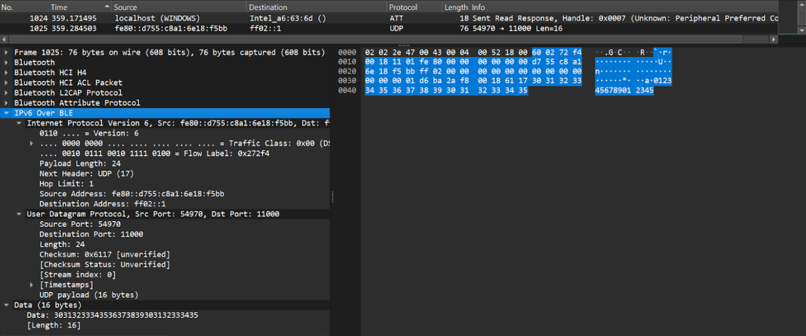

---
title: "IPv6 Over Bluetooth for Non Low Powered Devices"
category: info

docname: draft-elkins-v6ops-ipv6blt-latest
submissiontype: IETF  # also: "independent", "editorial", "IAB", or "IRTF"
number:
date:
consensus: true
v: 3
area: "Operations and Management"
workgroup: "IPv6 Operations"
keyword:
 - next generation
 - unicorn
 - sparkling distributed ledger
venue:
  group: "IPv6 Operations"
  type: "Working Group"
  mail: "v6ops@ietf.org"
  arch: "https://mailarchive.ietf.org/arch/browse/v6ops/"
  github: "mrakshith21/draft-ipv6-over-bluetooth"
  latest: "https://mrakshith21.github.io/draft-ipv6-over-bluetooth/draft-elkins-v6ops-ipv6blt.html"

author:
 -
    fullname: "Nalini Elkins"
    organization: Inside Products, Inc.
    email: "nalini.elkins@insidethestack.com"
 -
    fullname: "Mohit P. Tahiliani"
    organization: NITK Surathkal
    email: "tahiliani@nitk.edu.in"
 -
    fullname: "Rakshith Mohan"
    organization: NITK Surathkal
    email: "rakshith21mohan@gmail.com"
 -
    fullname: "Tejas Sankpal"
    organization: NITK Surathkal
    email: "tejas@gmail.com"
 -
    fullname: "Shrinidhi Ballal Nidamboor"
    organization: NITK Surathkal
    email: "ballalshrinidhi@gmail.com"

normative:

informative:

--- abstract

IPv6 over Bluetooth enables devices to communicate using the IPv6 protocol stack over Bluetooth wireless connections, expanding the range of networking options available to devices with Bluetooth capability. RFC 7668 {{?RFC7668}} and RFC 9159 {{?RFC9159}} describe IPv6 over Bluetooth for Bluetooth Low Energy devices. However, the potential of this technology has not been fully explored. This document proposes the use of this technology for non low powered devices with an optional header compression and also discusses some use cases.

--- middle

# Introduction

Bluetooth is a low-power wireless technology designed for short-range control and monitoring applications.  To enhance IoT capabilities, the IETF has developed specifications for IPv6 over BLE devices, outlined in RFC 7668 {{?RFC7668}}. This RFC primarily addresses star topology, while RFC 9159 {{?RFC9159}} extends IPv6 mesh networking capabilities over BLE links. Despite its focus on low-power devices, the implementation of IPv6 over BLE can extend to non-low powered platforms like Windows, Linux, Android OS, and iPhone running on personal computers and mobile phones.

By adhering to the Internet Protocol Support Profile (IPSP), published by the Bluetooth SIG, devices such as personal computers and smartphones can harness IPv6 over Bluetooth, presenting an alternative connectivity solution. This integration amalgamates the benefits of IPv6's robust addressing and routing capabilities with Bluetooth's simplicity.

Adding the IPv6 over Bluetooth functionality depends on the design and flexibility of the operating system. However, the adaptation layer need not be built from scratch since the Bluetooth L2CAP Protocol supports fragmentation and reassembly. Furthermore, in the case of unconstrained devices, header compression is not necessary (but can be kept optional if the Bluetooth MTU size is small, or if low powered devices are also involved). This document discusses a few use cases of this technology in disaster recovery, near field chat and IoT gateways. It also presents an implementation of IPv6 over Bluetooth on Windows.

# Use cases

IPv6 over Bluetooth can be used as an alternate technology for connecting devices, while using the vast features of IP as well as the low powered interface of Bluetooth. By developing implementations of the IPv6 over Bluetooth stack on different operating systems, we can facilitate the use of this technology for non low powered devices and explore its potential. This section discusses some use cases.

## Internet Shutdowns

IPv6 over Bluetooth can be particularly useful during internet shutdowns for many reasons. They can act as an alternative communication during an internet shutdown, when traditional communication methods (such as Wi-Fi) might be disrupted. Bluetooth, which operates on short-range radio frequencies, can provide an alternative path for communication, allowing devices to connect directly with each other. Bluetooth can support mesh networking, where devices connect to form a network that can deliver messages across multiple hops. This can help in maintaining a local network of connected devices even when the internet is unavailable. By using IPv6, which allows for a large number of unique IP addresses, devices can effectively communicate within this mesh network.

By making use of Bluetooth with IPv6, we can create a decentralized networks that are less reliant on centralized internet infrastructure. This can be particularly useful in cases where the internet infrastructure are frequently damaged. The reduction in the dependence on internet through the use of IPv6 over Bluetooth will reduce the losses and the problems caused by the internet shutdowns.

## Disaster recovery

In a disaster area where traditional means of communication like the internet and cables are damaged or unavailable, establishing connectivity between devices can be critical for coordination, rescue efforts, and communication with survivors. Devices can form adhoc networks with each other using Ethernet cables or Bluetooth, but it is insufficient to connect the entire network. In such a situation, IPv6 over Bluetooth can be a potential means of forming a network of connected devices.

We make the assumption that devices are Bluetooth enabled and are in Bluetooth range, so as to form a network of Bluetooth devices. As described in RFC 9159 {{?RFC9159}} IPv6 over Bluetooth for Mesh Networks, devices can then take up the roles similar to a 6LN, or 6LR. In other words, some devices act as nodes, and some as routers as well. Note that routers forward packets only within the network. In the event that the Internet is accessible for some of the devices, they can act as 6LBR or border routers. With the IPv6 over Bluetooth layer available on the devices, applications can continue to use IP while the actual communication uses Bluetooth. This idea can be backed by the fact that Bluetooth is available not only on PCs but mobile phones as well, which leads to the formation of a network with more links.

There are some things to consider:

- Devices must enforce IPv6 over IPv4 since the technology is only designed to transmit IPv6 packets over Bluetooth.
- Selection of devices as routers, or border routers is a key challenge. The border router must ensure that devices in its domain have unique addresses. The network also needs to have an IPv6 prefix, which is to be determined.

## Chat application

Bluetooth chat gained prominence through Bridgefy during the Hong Kong protests when the Internet was shut down. IPv6 over Bluetooth offers an enhanced alternative, allowing any network application, including chat apps, to operate similarly as on IPv6. In remote areas or emergencies where Internet access is unavailable, local networks can be established using IPv6 over Bluetooth.

A crucial consideration is the lack of server communication during Internet outages. Therefore, chat applications must handle communication and data storage locally, bypassing the need for a server to relay messages. Thus, direct message transmission between devices is necessary. Assuming devices maintain constant IPv6 addresses (link-local addresses) within the network, a user discovery process becomes essential. Devices can discover each other similar to Bluetooth scanning, but the network can encompass a larger number of devices than typical Bluetooth range allows.

One of the advantages of this mechanism over plain Bluetooth is that devices acting as routers can forward packets using established routing protocols. Otherwise, the application would need to manage this, resulting in increased burden on the application and higher delays. IPv6 over Bluetooth thus provides a more efficient and scalable solution for local communication during Internet disruptions.

## IoT Gateways

Use cases in building management, healthcare, workplaces, manufacturing, logistics and hospitality have introduced low-power IoT devices into their environments. These devices typically do not support IP-based interfaces, hence there is a need for gateway functions to allow these devices to communicate with the applications that manage them. IoT gateways provide various functionalities depending on the kind of devices they are connected to and their functionality. For example, authentication and authorization of application clients that will access device, interfaces that allow for bi-directional communication to non-IP device and one or more channels to process requests, responses, and asymmetric communciations with the non-IP radio resources (access points) in the system and so on. IoT networks make use of such customized gateways which communicate with each other and external networks to fulfill the required functionality.

IPv6 over Bluetooth can be used in IoT networks wherein multiple IoT gateways communicate with each other and a central router using IPv6 over Bluetooth Low Energy (BLE). The topology consists of IoT devices connected to local gateways, which then relay data to the central router for external connectivity.

~~~
               Iot Gateway 1
                     |
                     |
IoT Gateway 2 --- Border Router ------------- Internet
                     |
                     |
               IoT Gateway 3
~~~
{: #fig-gateways title="Multiple IoT gateways connected through a border router"}

## Relevant Technology

### GATT

GATT (Generic ATTribute Profile) defines the way that two Bluetooth Low Energy devices messages transfer between each other. It uses a generic data protocol called the Attribute Protocol (ATT), which is used to store services, and characteristics in a simple lookup table with 16-bit IDs (UUIDs). GATT transactions in BLE are based on high-level, nested objects called Profiles, Services, Characteristics and Control Points. Services are used to break data up into logical entities, and contain specific chunks of data called characteristics. A service can have one or more characteristics, and each service distinguishes itself from other services by means of a unique numeric ID called a UUID, which can be either 16-bit (for officially adopted BLE Services) or 128-bit (for custom services). The lowest level concept in GATT transactions is the Characteristic, which encapsulates a single data point. Each characteristic distinguishes itself via a pre-defined 16-bit or 128-bit UUID.

### IPv6 over Bluetooth networks and the IPSP

As per RFC 9159 {{?RFC9159}}, for IPv6 over BLE mesh networks, a multilink model is chosen. The network consists of nodes 6LN (node), 6LR (router), and 6LBR (border router). A 6LN is a peripheral node which connects to the network through a 6LR or a 6LBR. A 6LR connects 6LN’s to other 6LR’s or 6LBR. One or more 6LBRs are connected to the Internet. A router can manage connections with a number of peripheral devices, while a peripheral is usually connected only to a central node. A single global unicast prefix is used on the whole subnet.
The IPSP enables discovery of IP-enabled devices and the establishment of a link-layer connection for transporting IPv6 packets. The IPSP defines the node and router roles for devices that consume/originate IPv6 packets and for devices that can route IPv6 packets, respectively.

### Address Configuration
RFC 7668 {{?RFC7668}} specifies a stateless address autoconfiguration scheme for all nodes in the network. An IPv6 link-local address is assigned to the Bluetooth interface based on the 48-bit Bluetooth device address. A 64-bit address is generated from the Bluetooth address, which is prepended with fe80::/64. Mechanisms for registering a non link local address, and multiple addresses are also provided.

### Header Compression
Since BLE communication aims to conserve power, IPv6 over BLE involves header compression to reduce the size of IPv6 packets. This compression is based on the 6LoWPAN IPv6 header compression as specified in RFC 6282 {{?RFC6282}}. However, since the document focuses mainly on IPv6 over Bluetooth for non low powered devices, header compression is optional, though it is provided in the implementation.

# Implementation of IPv6 over Bluetooth on Windows

In this section, we describe an implementation of IPv6 over Bluetooth on Windows.

## Architecture
There are two primary components to this implementation:

- WFP callout driver
- Packet processing app

Additionally, there are four libraries in this project to support functionality in the Packet Processing App:

- A custom driver interoperability library.
- A Bluetooth GATT library, also including device enumeration and discovery.
- A 6LoWPAN library.

{{fig-arch}} illustrates the system architecture for this solution.

<!--  -->

<!-- Figure 2: IPv6 over Bluetooth Architecture -->

~~~
                    +--------------+
                    |    6LoWPAN   |
                    | library (DLL)|
                    +--------------+
                           |
                           |
                           |
+----------------+  +--------------+  +----------------+
| Driver interop |  |    Packet    |  | Bluetooth GATT |
| library        |--|  processing  |--| library        |
+----------------+  |    UWP app   |  +----------------+
          |         +--------------+	      |
          +------------------+		      |
User mode	             |		      |
-----------------------------|----------------|-------------
Kernel mode		     |		      |
                             |		      |
 +--------------+	     |		   +--------------+
 |      UDP     |	     |		   | Bluetooth LE |
 +--------------+     +---------------+    +--------------+
 |     IPv6     |     |  WFP callout  |	   |   Bluetooth  |
 +--------------+     |    driver     |	   |     L2CAP    |
 |Wi-Fi/Ethernet|     +---------------+	   +--------------+
 +--------------+
~~~
{: #fig-arch title="Architecture"}

The architecture consists of components operating in the user mode as well as kernel mode.

The kernel mode involves low level operations such as filtering packets through network interfaces and establishing Bluetooth links. The driver is a core component that filters outgoing IPv6 packets and can also filter incoming ones, forwarding them appropriately. It also can push a given IPv6 packet embedded in a Bluetooth packet, into the network stack, for an appropriate application to consume.

Components operating in the user mode are as follows. The Packet Processing App, working with the driver, is an important component that bridges the packet's transition from the IP layer to Bluetooth and vice versa. It obtains Bluetooth-based link-local addresses, scans for nearby Bluetooth devices, compresses IPv6 packet headers and initiates transfer of Bluetooth packets or receipt. It makes use of libraries - a 6LowPAN library for address and header compression, a driver interop library to communicate with the driver. The GATT server, also  initiated by the Packet Processing App, provides IPSP, supporting IPv6 over Bluetooth and operates on all node and allowing them to act as both clients and servers as needed.

## Components
The following are the components involved in the implementation of the IPv6 over Bluetooth in Windows operating system.

### Driver
A WFP driver (Windows Filtering Platform) in Windows is a network traffic processing component that provides a programmable interface for filtering and examining network packets at various layers of the TCP/IP protocol stack.
The driver acts as a bridge between the Windows TCP/IP network stack and the Bluetooth stack. It filters outgoing IPv6 packets for the nodes running in the BLE network. These packets are then processed by the packet processing app. The driver can also filter incoming IPv6 packets and inject them into the TCP/IP stack.

### Packet Processing App
This is a core component that is a part of the bridge along with the driver. Firstly, it obtains a link-local address based on the Bluetooth address. It also scans for nearby devices and identifies compatible ones. Then, it subscribes and receives IPv6 packets from the driver. After compressing the header, it transfers the packet over to nearby compatible devices. The packet processing app on the other device receives the packet. If it is for that device, it sends it to the driver for inbound injection into the TCP/IP network stack, otherwise, sends the packet to each nearby device.

### GATT server
The GATT server is started by the packet processing app. It contains the Internet Protocol Support Service (IPSP), which indicates that the server supports IPv6 over Bluetooth. A node must write to the characteristics of the IPSP to send a packet.

### DriverTest
This is a sample application that generates UDP packets with hard coded data. The purpose is for the driver to intercept these packets and send them to the Packet Processing App for further action.

## Bluetooth packet layout

An IPv6 over BLE packet consists of an IPv6 packet embedded in a Bluetooth packet. A sample packet captured from the application is shown in {{fig-packet}}

<!--  -->
<!--
 -->

<!-- Figure 3: Packet Layout -->

~~~
+--------------------------------------------+
| Bluetooth L2CAP Protocol                   |
+--------------------------------------------+
| Bluetooth Attribute Protocol               |
+--------------------------------------------+
|  >  Opcode: Write Command (0x52)           |
+--------------------------------------------+
|  >  Handle: 0x0018                         |
+--------------------------------------------+
|  >  Value: IPv6 Packet                     |
+--------------------------------------------+
|          > IPv6 Header                     |
+--------------------------------------------+
|          > UDP Header                      |
+--------------------------------------------+
|          > Data: Hello World               |
+--------------------------------------------+

~~~
{: #fig-packet title="Packet layout"}

A custom lua dissector to dissect the IPv6 packet within the Bluetooth ATT Value field was designed. In the application, the IPv6 packet is written to a GATT characteristic with handle 0x0018. So, the custom dissector is invoked when the ATT handle’s value is 0x0018. The buffer is then passed to the in built IPv6 dissector which dissects the data in the ‘Value’ field.

## Header compression
Header compression is implemented as a library (named  6LoWPAN library), not as an operating system layer or module. The compression/decompression code was based on Contiki OS,  an open source operating system in which 6LoWPAn is implemented as an adaptation layer in the network stack. This is not possible on Windows because it is closed source. Therefore, the concept of an adaptation layer is spread across the driver and this module
Thus, the header compression code lies in the user space, as a library.

- While the packet processing app receives a packet from the driver, the 6LoWPAN library is called to compress the header, before sending it over Bluetooth.
- Similarly, when a packet is received over Bluetooth, the 6LoWPAN library is called to decompress the header.

## Comparison with RFC 7668

RFC 7668 {{?RFC7668}} specifies RFC 6282 {{?RFC6282}} for 6LoWPAN

- Header compression
- Fragmentation and reassembly
- Stateless auto configuration

The 6LoWPAN library of the project fulfills the first and third goals, the second goal is automatically performed at the Bluetooth L2CAP layer by Windows Bluetooth.
In particular, IPv6 header compression is implemented as per RFC 6282 {{?RFC6282}}, and IPv6 address compression is implemented as per RFC 7668 {{?RFC7668}}.

# Conventions and Definitions

{::boilerplate bcp14-tagged}

# Security Considerations

The security considerations specified in RFC 7668 {{?RFC7668}} apply for IPv6 over Bluetooth in non lower powered devices as well. RFC 7416 {{?RFC7416}} provides an overview of such threats. Particularly, the routing protocol poses opportunities for threats and attacks. Considering that devices are not resource constrained, the scale of threats can only increase.

# IANA Considerations

This document has no IANA actions.

--- back

# Acknowledgments
{:numbered="false"}

The authors would like to acknowledge the developer of [IPv6OverBluetoothLowEnergyMesh](https://github.com/uwbiot/IPv6OverBluetoothLowEnergyMesh), for his contribution of a Windows implementation for IPv6 over Bluetooth.
